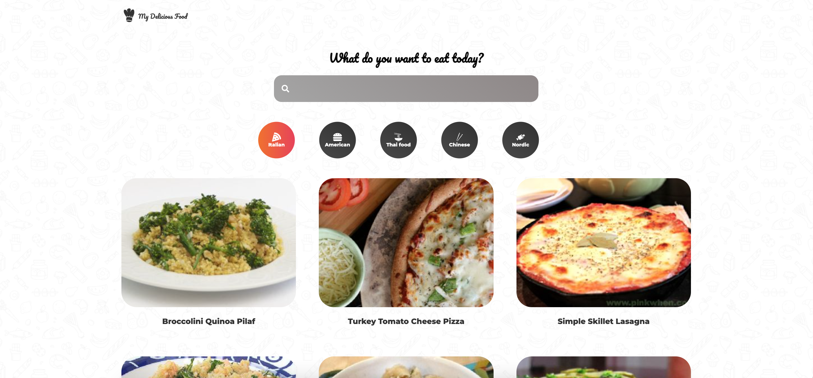

# Recipe App

A web application with different recipes from the Spoonacular open API.

[Live demo](https://recipe-website-seven.vercel.app/ "Recipe App")

### Why did I make this project?

I always have a hard time coming up with what to make for dinner so I needed some sort of application where you can type a keyword or something or just look through different categories and it will give you a variety of recipes. So I thought why not make something useful like that while I also get to practice my Frotnend skills? 
___

### What technologies did I use?
 
 * React JS
 * Styled Components
  ___

### What did I learn?

Fetching and displaying data is something I've always wanted to learn and get better at and I definitely feel after doing this I've made progress in that area. Learning how to work with different endpoints etc. 
___

### Future improvements

Mainly what I'd like to do is clean up the code a little, and particularly the fetch function. Instead of writing out the function in each component I'm gonna create a custom hook and just change the endpoint to what it should be set to.

